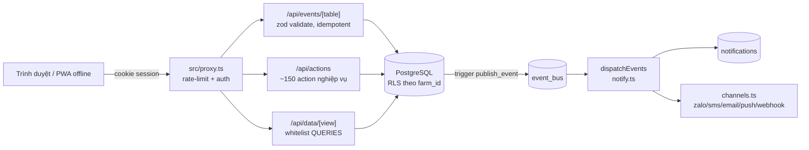

# Kiến trúc ITRAN OS — đọc trong 10 phút

Trước đây `AGENTS.md` là file tự sinh của Next.js (trỏ vào `node_modules/next/dist/docs`) — dev mới đọc không học được gì về ITRAN AGRI. Tài liệu này là điểm vào thật; chi tiết đầy đủ nằm ở `CLAUDE.md` (mục "Cấu trúc"/"10 luật") và `docs/plan/00…10`.

## Luồng request

- **Auth**: cookie JWT (`src/lib/auth.ts`), session lật qua `sessions.revoked_at`. Vai trò (`role`) quyết định quyền ghi/duyệt, không phải quyền UI.
- **RLS 2 tầng**: `app.org_id`/`app.farm_id`/`app.role`/`app.farm_ids` set qua `withCtx()` mỗi request; mọi bảng nghiệp vụ enable RLS, kết nối bằng `app_user` (không phải superuser) — xem `supabase/migrations/0003_rls.sql`.
- **Bảng sự kiện append-only**: tạo qua `itran_make_event_table()`, không UPDATE/DELETE (trigger + revoke); sửa = bản mới `supersedes_id`; ≤72h công nhân tự supersede, sau đó qua `adjustments` có duyệt.

## Data pipeline (đêm + realtime)

- **event_bus** (`0016_notifications.sql`): mọi thay đổi quan trọng gọi `publish_event()` → 1 dòng `event_bus`. `dispatchEvents()` claim atomic (`FOR UPDATE SKIP LOCKED`), retry thật tới 5 lần rồi mới đánh `dead_letter_at` (0197) — không còn "lỗi = mất luôn" như trước.
- **RC engine** (`rc_rules`, `runRecon()`): đối soát 2 nguồn số liệu độc lập mỗi trại/ngày, ghi `recon_results` bất biến.
- **Alert engine** (`runAlerts()` + `alert_rules`): phần lớn ngưỡng data-driven qua `settings`/`alert_rules` (luật 7 "cấu hình = dữ liệu"), không hard-code trong code.
- **Job đêm**: `/api/jobs/[job]` — chạy tay (session) hoặc cron. 2 đường cron song song, chọn 1 theo hạ tầng deploy:
  - **Docker**: `instrumentation.ts` (`setInterval`, cần `SCHEDULER=1` + `JOB_KEY`).
  - **Vercel**: `vercel.json` (`crons`) gọi GET, xác thực bằng `CRON_SECRET` — xem `docs/DEPLOY.md`.

## Báo cáo & export

- Mọi báo cáo đi qua whitelist `QUERIES` (`src/lib/queries.ts`) + route tổng quát `/api/data/[view]` — không có trang nào tự viết SQL (luật 8). Thêm chỉ số = thêm 1 mục catalog.
- Export tuân thủ/dữ liệu mở: `/api/exports/[kind]` (audit-pack, tt66, sales-tax, EPCIS 2.0, `table:{tên}` whitelist) — luôn ghi `audit_log` action=EXPORT trước khi chạy.

## Deploy

Pipeline thủ công `.github/workflows/deploy.yml`: `gate` (rebuild từ Postgres trắng + lint/tsc/test/build) → (production: `staging-gate` — commit phải có tag `staging-verified`) → `db-push` (Supabase) → `app` (build, Vercel nếu có `VERCEL_TOKEN`). Chi tiết + biến môi trường: `docs/DEPLOY.md`.

## Migration — quy ước forward-only

195+ migration hiện có đều forward-only, không có down-script — chấp nhận được vì backfill down-script
cho toàn bộ lịch sử là việc lớn không tương xứng giá trị (schema cũ, dữ liệu seed đã đổi nhiều lần).
**Quy ước cho migration MỚI từ đây về sau**: nếu migration thay đổi có rủi ro cần lùi lại nhanh (đổi
kiểu cột, xoá cột/bảng, đổi ràng buộc không tương thích ngược) — ghi kèm 1 comment khối `-- DOWN:` ở
cuối file mô tả câu lệnh lùi lại thủ công (không cần chạy tự động, chỉ cần có sẵn để dùng khi cần gấp).
Migration thuần thêm mới (bảng/cột/hàm/index mới, không đổi hành vi cũ) không bắt buộc.

## Đi tiếp

- Nghiệp vụ gốc (điều luật, quy trình, SOP): `docs/bo-goc/`, `docs/plan/00…10`.
- Danh sách migration theo mốc + module: `CLAUDE.md` mục "Cấu trúc" (cập nhật mỗi phiên lớn).
- Việc còn treo/đã tự nhận biết: `docs/backlog.md`.
